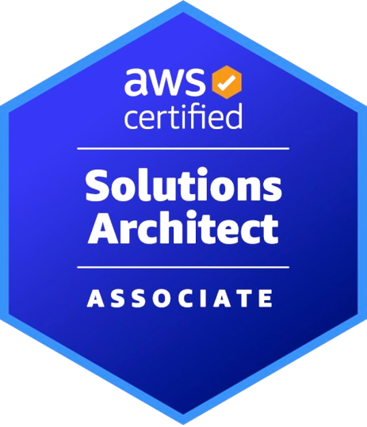
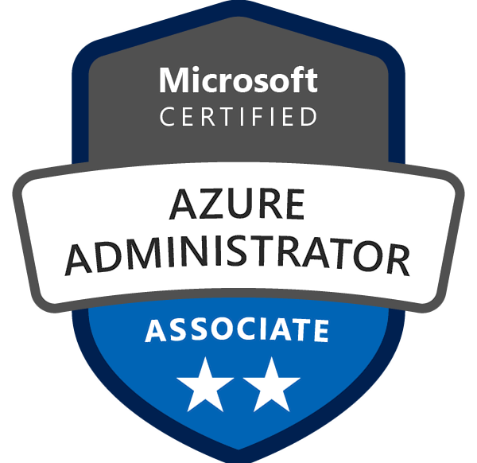
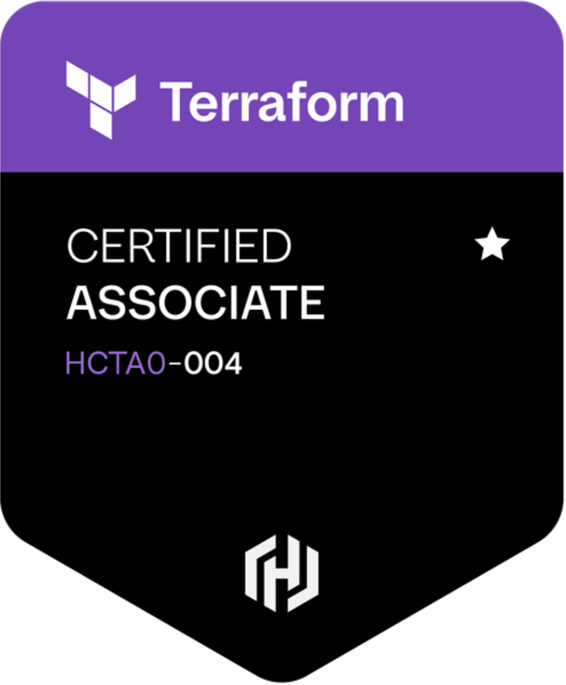
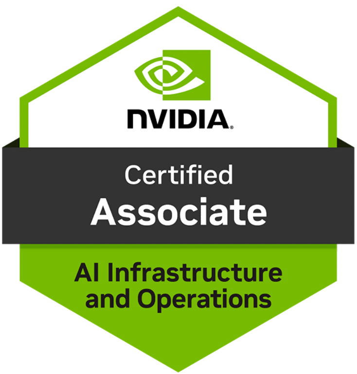
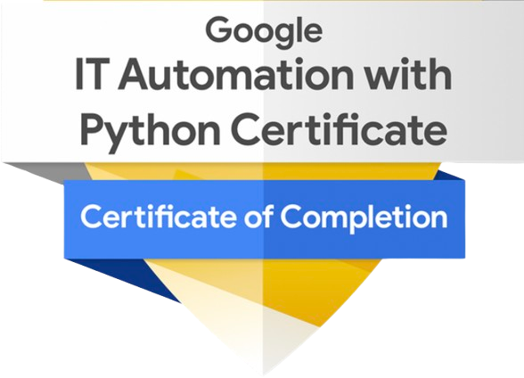
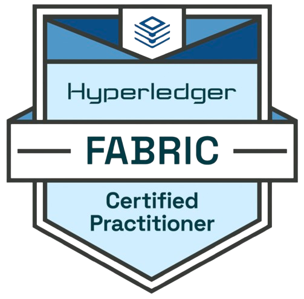
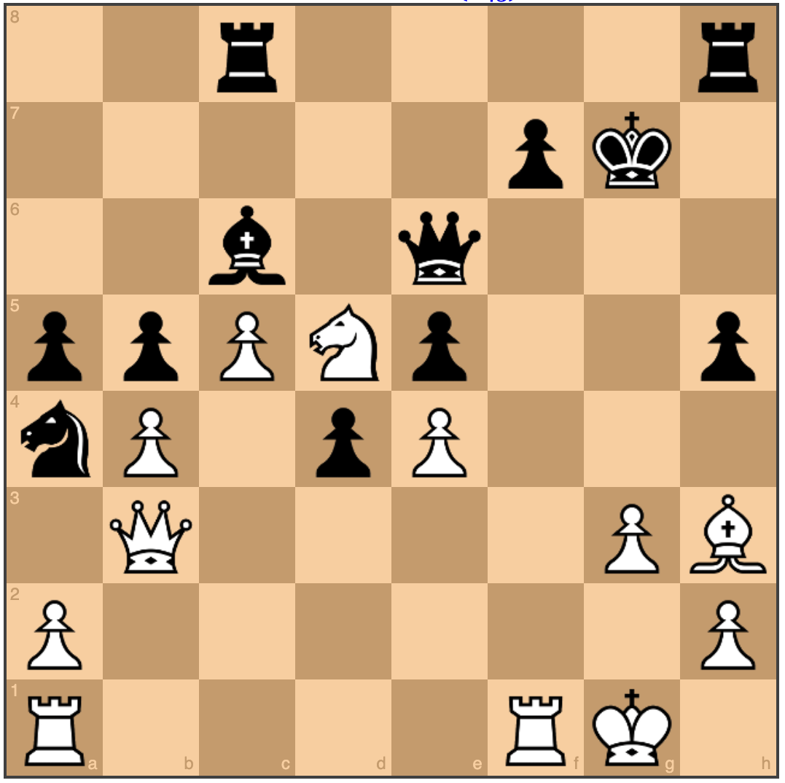
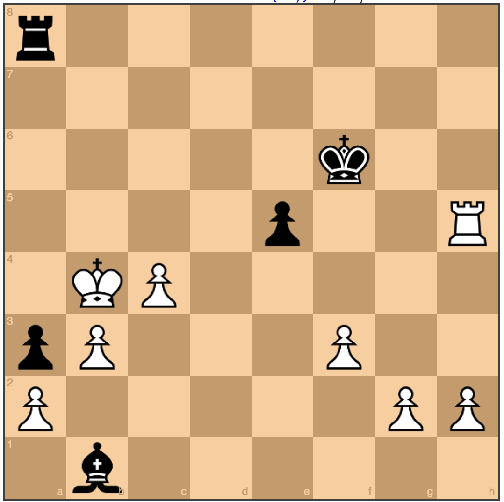

# Hi, I'm Yasser Saber 👋

### Systems & Cloud Engineer
### AWS • Azure • Hybrid Infrastructure • Terraform • Automation • GenAI

I build and modernize enterprise infrastructure across cloud, hybrid, and on-prem environments —  
with a focus on **automation, Infrastructure as Code, reliability, and practical AI integration**.

 

---

## ☁️ I build infrastructure that runs reliably

I'm a **Systems & Cloud Engineer with 10+ years of experience** across enterprise infrastructure, virtualization, identity, disaster recovery, cloud migration, and IT operations.

My background started deep in **Windows Server, Active Directory, virtualization, networking, and enterprise IT operations** and has expanded into:

- ☁️ AWS & Microsoft Azure
- 🏗️ Terraform & Infrastructure as Code
- ⚙️ PowerShell, Python & automation
- 🔐 Hybrid identity & cloud security
- 🚀 Cloud migration & disaster recovery
- 🤖 Generative AI, RAG & cloud AI services

I enjoy solving infrastructure problems where **systems engineering, automation, cloud architecture, and AI** intersect.

---

# 🏅 Certifications

  
  &nbsp;&nbsp;&nbsp;
  
  &nbsp;&nbsp;&nbsp;
  

  
  &nbsp;&nbsp;&nbsp;
  
  &nbsp;&nbsp;&nbsp;
  

  

  Click any certification badge to verify the credential.

### 🎓 Education

[**Engineer's Degree in Computer Science Engineering — INSEA School of Engineering**](https://www.canva.com/design/DAFSPSbOl1Y/Kqma5w2bqZor5BDgYE3Pfw/view)

---

## ⚡ Technologies

### ☁️ Cloud & Infrastructure as Code

### 🖥️ Systems, Identity & Virtualization

### ⚙️ Automation, Scripting & DevOps

### 🔐 Networking, Security & IT Operations

### 🤖 GenAI & Cloud AI

---

## 🛠️ Selected Engineering Experience

- **AWS Bedrock RAG Assistant** — Built a production-ready conversational AI solution using Amazon Bedrock, Anthropic Claude, Titan Embeddings, an S3-backed knowledge base, Amazon Lex, IAM, and Bedrock Guardrails.
- **AWS VM Migration** — Executed a multi-wave migration of Linux and Windows servers with AWS Application Migration Service (MGN), Systems Manager validation, test launches, and production cutover.
- **Azure Disaster Recovery Automation** — Implemented Azure Recovery Services Vault and Microsoft Azure Backup Server for Hyper-V workloads, defined backup policies with Bicep, and used Python/Azure Functions for monitoring and restore validation.
- **Hybrid Identity & Endpoint Modernization** — Migrated identity toward Microsoft Entra ID and Microsoft 365, deployed Windows Autopilot and Intune, and supported SharePoint, Teams, OneDrive, Defender, and endpoint compliance.
- **Enterprise Infrastructure Modernization** — Administered Active Directory, DNS, DHCP, GPO, FortiGate, Hyper-V/VMware environments, high-availability Windows Server infrastructure, and multi-site IT operations.

  
---
# ♟️ Moroccan Chess Champion

  <b>Competitive chess has shaped how I approach engineering:</b> 
  pattern recognition • calculation • decision-making under pressure • long-term planning

Selected performances against internationally titled players:

<table>
<tr>
<td width="33%" align="center">

### 🇲🇦 Yasser Saber vs Juan Bellon Lopez

**Gibraltar Masters — 2016**  
Benoni Defense • **1–0**

</td>

<td width="33%" align="center">

### Anurag Mhamal vs 🇲🇦 Yasser Saber

**Roquetas de Mar Open — 2018**  
Pirc Defense • **½–½**

</td>

<td width="33%" align="center">

### 🇲🇦 Yasser Saber vs Hichem Hamdouchi

**Arab Clubs — 2016**  
Semi-Slav Defense • **½–½**

</td>
<td width="33%" align="center">
  
</table>

  <i>Different board, same mindset: understand the system, anticipate failure modes, and think several moves ahead.</i>

---

## 🎯 Current Focus

- Hybrid cloud engineering across **AWS + Azure**
- **Infrastructure as Code** with Terraform and Bicep
- Infrastructure automation with **PowerShell + Python**
- Cloud migration, backup, disaster recovery, and operational resilience
- Identity and endpoint management with **Active Directory, Entra ID, Microsoft 365, and Intune**
- Practical **GenAI/RAG integrations** for IT operations and automation
- Codex prompt engineering & **AI agents** orchestration for stocks trading & risk management
  
---
